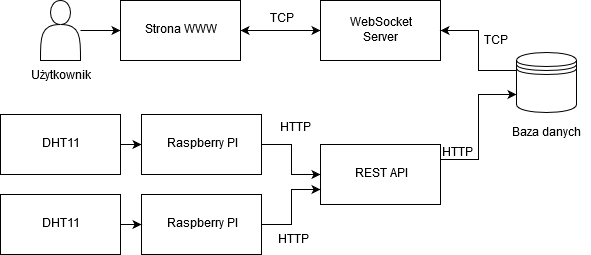
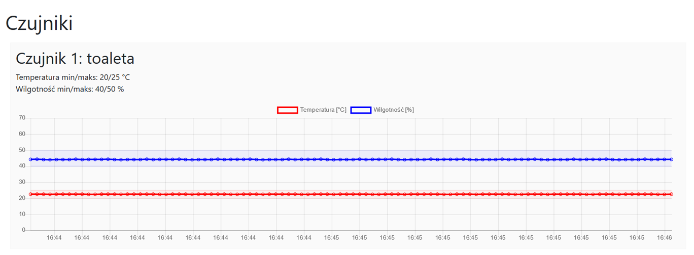
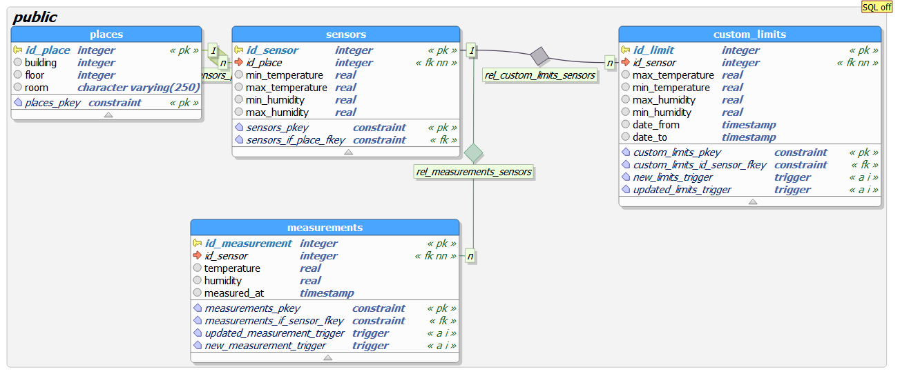

# System kontroli wilgotności i temperatury z archiwizacją, prezentacją i alarmowaniem
##### Autorzy: Wojciech Harasymowicz, Rafał Ileczko

### Opis projektu
Celem projektu jest zbudowanie systemu czujników wilgotności i temperatury mierzącego te parametry w pomieszczeniach hali produkcyjnej. Zapisane w bazie dane są wizualizowane w przygotowanej aplikacji internetowej. Dodatkowo stworzono prosty system alarmowania w przypadku, gdy wartości wyjdą poza ich bezpieczny, z góry ustalony zakres. System docelowo zostanie użyty w istniejącym przedsiębiorstwie `Colorland`.

W celach demonstracyjnych panel WWW jest dostępny pod adresem [http://51.15.87.74:8888](http://51.15.87.74:8888).
Repozytorium z kodem źródłowym mieści się na stronie [https://github.com/rilek/humidity-front](https://github.com/rilek/humidity-front).

### Architektura projektu
Projekt można podzielić na 4 sekcje:
1. Sprzętową - jest złożona z urządzeń Raspberry, z czego do każdego podłączony jest czujnik temperatury i wilgotności `DHT11`,
2. Backendową (serwerową) - jest to REST Api obsługujące jedno zapytanie - wysłanie nowego pomiaru, oraz serwer Websocket, który komunikuje się z bazą danych i częścią frontendową,
3. Frontendową (interfejs) - interfejs graficzny komunikujący się poprzez websockety z bazą danych,
4. Baza danych - zbiera wszystkie dane. Element pośredni pomiędzy REST API, a WebSocketami.

Architekturę obrazuje poniższy obrazek:




### Łańcuch komunikacji
W projekcie występują różne sposoby komunikacji.
RaspberryPI po wykonaniu pomiaru wysyła zapytanie POST do serwera REST z danymi pomiarowymi. Urządzenie jest połączone z internetem poprzez przewód ethernet. API po otrzymaniu zapytania przesyła je do bazy danych za pomocą kodu SQL z sekcji `Baza danych`. Baza danych po wpisaniu rekordu z pomiarem wywołuje funkcję, która emituje komunikat TCP. Komunikat ten przechwytuje serwer WebSocket, który z kolei przekazuje go aktywnemu użytkownikowi. Pomiar zostaje dopisany do aktualnie zapisanych w stanie aplikacji, przy czym pokazywane jest tylko 100 najnowszych pomiarów.

Dodatkowo użytkownik wchodząc na stronę WWW łączy się z serwerem WebSocket, który przesyła mu 100 najnowszych pomiarów.

### Strona WWW
Strona WWW jest dostępna jako demo pod adresem [http://51.15.87.74:8888](http://51.15.87.74:8888). Zawiera ona listę czujników ze szczegółowymi danymi, oraz wykresem wartości. Dane są aktualizowane w czasie rzeczywistym. Pokazywane jest 100 najnowszych pomiarów. Poziome linie oraz kolorowy obszar między nimi ilustruje zakres akceptowalnych wartości.

Po przekroczeniu przez mierzony parametr wartości granicznej aktywowany jest alarm. W przypadku jego wyłączenia, kolejny alarm nie wystąpi przez okres 5 min.

Przykładowy stan aplikacji www na obrazku poniżej:



### Baza danych
Baza danych złożona jest z 3 tabel:
1. Sensors - zawiera informacje na temat miejsca położenia w firmie, oraz graniczne dopuszczalne wartości temperatury i wilgotności.
2. Places - dokładne infomacje o tym gdzie jest czujnik - budynek, piętro, pokój
3. Measurements - zawiera informacje o mierzacym czunjniku, czas wykonania pomiaru. Każdy rekord oznacza pojedynczy pomiar.

Dokładną strukturę bazy obrazuje poniższy rysunek:



#### SQL tworzący bazę danych
```
CREATE DATABASE humidity;

CREATE TABLE places (
  id_place SERIAL NOT NULL PRIMARY KEY,
  building integer,
  floor integer,
  room varchar(250)
);

CREATE TABLE sensors (
  id_sensor SERIAL NOT NULL PRIMARY KEY,
  if_place serial references places(id_place)
);

CREATE TABLE measurements (
  id_measurement SERIAL NOT NULL PRIMARY KEY,
  id_sensor serial references sensors(id_sensor),
  temperature real,
  humidity real,
  measured_at TIMESTAMP
);

CREATE TABLE custom_limits (
  id_limit SERIAL NOT NULL PRIMARY KEY,
  id_sensor serial references sensors(id_sensor),
  max_temperature real,
  min_temperature real,
  max_humidity real,
  min_humidity real,
  date_from TIMESTAMP,
  date_to TIMESTAMP
);


CREATE OR REPLACE FUNCTION notify_new_measurement() RETURNS trigger
    AS $BODY$
DECLARE
BEGIN
    PERFORM pg_notify('new_data', row_to_json(NEW)::text);
    RETURN NULL;
END;
$BODY$

LANGUAGE plpgsql
COST 100;

CREATE OR REPLACE TRIGGER new_measurement_trigger AFTER INSERT ON measurements
FOR EACH ROW EXECUTE PROCEDURE notify_new_measurement();


CREATE OR REPLACE FUNCTION notify_new_limits() RETURNS trigger
    AS $BODY$
DECLARE
BEGIN
    PERFORM pg_notify('new_limits', row_to_json(NEW)::text);
    RETURN NULL;
END;
$BODY$

LANGUAGE plpgsql
COST 100;

CREATE TRIGGER updated_limits_trigger AFTER INSERT ON custom_limits
FOR EACH ROW EXECUTE PROCEDURE notify_new_limits();
```


Pobieranie danych z poziomu frontendu odbywa się zapytaniem:
```
SELECT json_build_object(
  'id_sensor', id_sensor,
  'id_place', sensors.id_place,
  'min_temperature', sensors.min_temperature,
  'max_temperature', sensors.max_temperature,
  'min_humidity', sensors.min_humidity,
  'max_humidity', sensors.max_humidity,
  'building', places.building,
  'floor', places.floor,
  'room', places.room,
  'measurements', (SELECT json_agg(row_to_json(measurements))
                   FROM (SELECT * FROM (SELECT *
                                        FROM measurements
                                        WHERE measurements.id_sensor=sensors.id_sensor
                                        ORDER BY measured_at DESC
                                        LIMIT 100) measurements
                         ORDER BY measured_at ASC) AS measurements))
FROM sensors, places
WHERE places.id_place=sensors.id_place
```


Przykładowy kod SQL dodający kolejny pomiar:
```
INSERT INTO measurements(id_sensor, temperature, humidity, measured_at) values(1, 1.0, 1.0, '2018-06-06 09:18:02.786123')
```

### Uruchomienie backendu oraz frontendu lokalnie
#### Wymagania
* PostgreSQL >= v9.6.0
* Python >= v3.6.0
* NodeJS >= v8.9.4
* NPM >= v5.6.0

#### Instalacja bibliotek
* Frontend
```
npm install
```
* Backend
```
pip3 install flask psycopg2-binary
```

#### Skrypty uruchomieniowe
* Frontend
```
npm start
```
lub
Domyślnie strona będzie dostępna pod adresem: `localhost:8888`

* Backend
```
npm run api
```
lub
```
python3 backend/REST_post.py -p <port> -c <config_file.json>
```
Parametry są opcjonalne. Domyślnie REST Api będzie dostępne pod adresem: `localhost:5253`.
Druga wersja skryptu pozwala uruchomić backend bądź pod innym portem niż domyślny, bądź użyć innego pliku konfiguracyjnego o rozszerzeniu `.json`.